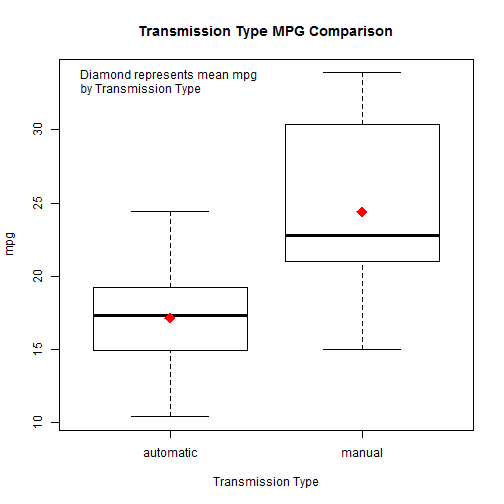

Regression - Quiz 2
========================================================

Question 1 & 2
----------

```r
x <- c(0.61, 0.93, 0.83, 0.35, 0.54, 0.16, 0.91, 0.62, 0.62)
y <- c(0.67, 0.84, 0.6, 0.18, 0.85, 0.47, 1.1, 0.65, 0.36)

plot(x,y)
```

 

$\bar X = \frac{\sum_{i=1}^n x_{i}}{n}$,    $\bar Y = \frac{\sum_{i=1}^n y_{i}}{n}$

$\beta_{1} = Cor(Y,X)\frac{Sd(Y)}{sd(X)}$ 

$\beta_{0} = \bar Y + \beta_{1} \bar X$

$e_{i} = y_{i} -  (\beta_{0} + \beta_{1} x_{i})$

$\sigma = \frac{\sum_{i=1}^n e_{i}^2}{n-2}$

$ssx = \sum_{i=1}^n (X - \bar X)^2$

$se\beta_{0} = \sigma \sqrt{\frac{1}{n} + \frac{\bar X^2}{ssx}}$

$se\beta_{1} = \frac{\sigma}{\sqrt{ssx}}$

$t\beta_{0} = \frac{\beta_{0}}{se\beta_{0}}$,    $t\beta_{1} = \frac{\beta_{1}}{se\beta_{1}}$


```r
n <- length(y)
beta1 <- cor(y, x) * sd(y) / sd(x)
beta0 <- mean(y) - beta1 * mean(x)
e <- y - beta0 - beta1 * x
sigma <- sqrt(sum(e^2) / (n-2)) 
ssx <- sum((x - mean(x))^2)
seBeta0 <- (1 / n + mean(x) ^ 2 / ssx) ^ .5 * sigma 
seBeta1 <- sigma / sqrt(ssx)
tBeta0 <- beta0 / seBeta0; tBeta1 <- beta1 / seBeta1
pBeta0 <- 2 * pt(abs(tBeta0), df = n - 2, lower.tail = FALSE)
pBeta1 <- 2 * pt(abs(tBeta1), df = n - 2, lower.tail = FALSE)
coefTable <- rbind(c(beta0, seBeta0, tBeta0, pBeta0), c(beta1, seBeta1, tBeta1, pBeta1))
colnames(coefTable) <- c("Estimate", "Std. Error", "t value", "P(>|t|)")
rownames(coefTable) <- c("(Intercept)", "x")

#Question 1
coefTable
```

```
##             Estimate Std. Error t value P(>|t|)
## (Intercept)   0.1885     0.2061  0.9143 0.39098
## x             0.7224     0.3107  2.3255 0.05296
```

```r
#Question 2
sigma
```

```
## [1] 0.223
```

```r
lm1 <- lm(y~x)

summary(lm1)
```

```
## 
## Call:
## lm(formula = y ~ x)
## 
## Residuals:
##     Min      1Q  Median      3Q     Max 
## -0.2764 -0.1881  0.0136  0.1660  0.2714 
## 
## Coefficients:
##             Estimate Std. Error t value Pr(>|t|)  
## (Intercept)    0.188      0.206    0.91    0.391  
## x              0.722      0.311    2.33    0.053 .
## ---
## Signif. codes:  0 '***' 0.001 '**' 0.01 '*' 0.05 '.' 0.1 ' ' 1
## 
## Residual standard error: 0.223 on 7 degrees of freedom
## Multiple R-squared:  0.436,	Adjusted R-squared:  0.355 
## F-statistic: 5.41 on 1 and 7 DF,  p-value: 0.053
```


Question 3 - 6,9

```r
lm2 <- lm(mpg~wt,mtcars)
summary(lm2)
```

```
## 
## Call:
## lm(formula = mpg ~ wt, data = mtcars)
## 
## Residuals:
##    Min     1Q Median     3Q    Max 
## -4.543 -2.365 -0.125  1.410  6.873 
## 
## Coefficients:
##             Estimate Std. Error t value Pr(>|t|)    
## (Intercept)   37.285      1.878   19.86  < 2e-16 ***
## wt            -5.344      0.559   -9.56  1.3e-10 ***
## ---
## Signif. codes:  0 '***' 0.001 '**' 0.01 '*' 0.05 '.' 0.1 ' ' 1
## 
## Residual standard error: 3.05 on 30 degrees of freedom
## Multiple R-squared:  0.753,	Adjusted R-squared:  0.745 
## F-statistic: 91.4 on 1 and 30 DF,  p-value: 1.29e-10
```

```r
confint(lm2)
```

```
##              2.5 % 97.5 %
## (Intercept) 33.450 41.120
## wt          -6.486 -4.203
```

```r
#Question 3
newdata <- data.frame(wt=mean(mtcars$wt));newdata
```

```
##      wt
## 1 3.217
```

```r
predict(lm2,newdata,interval="confidence")
```

```
##     fit   lwr   upr
## 1 20.09 18.99 21.19
```

```r
#Question 5
newdata <- data.frame(wt=3000/1000);newdata
```

```
##   wt
## 1  3
```

```r
predict(lm2,newdata,interval="prediction")
```

```
##     fit   lwr   upr
## 1 21.25 14.93 27.57
```

```r
#Question 6
length(mtcars$mpg)
```

```
## [1] 32
```

```r
lm2$df
```

```
## [1] 30
```

```r
sumCoef <- summary(lm2)$coefficients
sumCoef
```

```
##             Estimate Std. Error t value  Pr(>|t|)
## (Intercept)   37.285     1.8776  19.858 8.242e-19
## wt            -5.344     0.5591  -9.559 1.294e-10
```

```r
bnds <- sumCoef[2,1] + c(-1,1) * qt(0.975,df=lm2$df) * sumCoef[2,2]
bnds
```

```
## [1] -6.486 -4.203
```

```r
2*bnds
```

```
## [1] -12.973  -8.405
```

```r
#Question 9
denom <- sum((mtcars$mpg-mean(mtcars$mpg))^2);denom
```

```
## [1] 1126
```

```r
numer <- sum(lm2$residuals^2); numer
```

```
## [1] 278.3
```

```r
numer/denom
```

```
## [1] 0.2472
```


