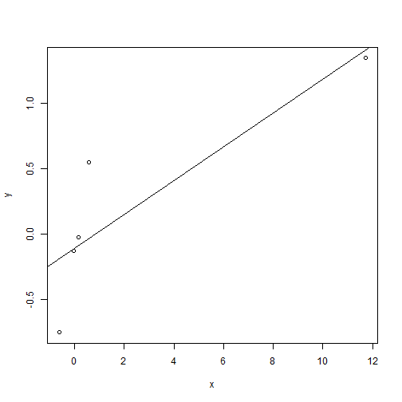
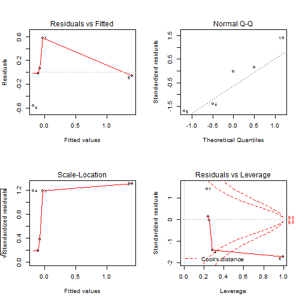
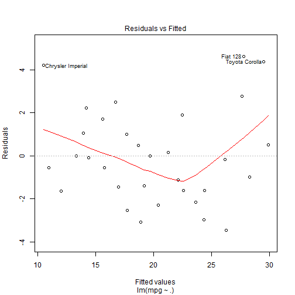
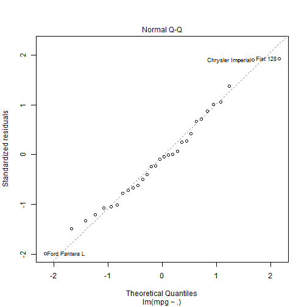

Regression - Quiz 3
========================================================

Question 1
----------

```r
library(plyr)
```

```
## Warning: package 'plyr' was built under R version 3.0.3
```

```r
cars <- mutate(mtcars,
               cyl=factor(cyl))
fit <- lm(mpg~cyl+wt,data=cars)
summary(fit)
```

```
## 
## Call:
## lm(formula = mpg ~ cyl + wt, data = cars)
## 
## Residuals:
##    Min     1Q Median     3Q    Max 
## -4.589 -1.236 -0.516  1.384  5.792 
## 
## Coefficients:
##             Estimate Std. Error t value Pr(>|t|)    
## (Intercept)   33.991      1.888   18.01  < 2e-16 ***
## cyl6          -4.256      1.386   -3.07  0.00472 ** 
## cyl8          -6.071      1.652   -3.67  0.00100 ***
## wt            -3.206      0.754   -4.25  0.00021 ***
## ---
## Signif. codes:  0 '***' 0.001 '**' 0.01 '*' 0.05 '.' 0.1 ' ' 1
## 
## Residual standard error: 2.56 on 28 degrees of freedom
## Multiple R-squared:  0.837,	Adjusted R-squared:  0.82 
## F-statistic: 48.1 on 3 and 28 DF,  p-value: 3.59e-11
```

Question 2
----------

```r
library(plyr)
cars <- mutate(mtcars,
               cyl=factor(cyl))
fit <- lm(mpg~cyl+wt,data=cars)
fit2 <- lm(mpg~cyl,data=cars)
summary(fit)
```

```
## 
## Call:
## lm(formula = mpg ~ cyl + wt, data = cars)
## 
## Residuals:
##    Min     1Q Median     3Q    Max 
## -4.589 -1.236 -0.516  1.384  5.792 
## 
## Coefficients:
##             Estimate Std. Error t value Pr(>|t|)    
## (Intercept)   33.991      1.888   18.01  < 2e-16 ***
## cyl6          -4.256      1.386   -3.07  0.00472 ** 
## cyl8          -6.071      1.652   -3.67  0.00100 ***
## wt            -3.206      0.754   -4.25  0.00021 ***
## ---
## Signif. codes:  0 '***' 0.001 '**' 0.01 '*' 0.05 '.' 0.1 ' ' 1
## 
## Residual standard error: 2.56 on 28 degrees of freedom
## Multiple R-squared:  0.837,	Adjusted R-squared:  0.82 
## F-statistic: 48.1 on 3 and 28 DF,  p-value: 3.59e-11
```

```r
summary(fit2)
```

```
## 
## Call:
## lm(formula = mpg ~ cyl, data = cars)
## 
## Residuals:
##    Min     1Q Median     3Q    Max 
## -5.264 -1.836  0.029  1.389  7.236 
## 
## Coefficients:
##             Estimate Std. Error t value Pr(>|t|)    
## (Intercept)   26.664      0.972   27.44  < 2e-16 ***
## cyl6          -6.921      1.558   -4.44  0.00012 ***
## cyl8         -11.564      1.299   -8.90  8.6e-10 ***
## ---
## Signif. codes:  0 '***' 0.001 '**' 0.01 '*' 0.05 '.' 0.1 ' ' 1
## 
## Residual standard error: 3.22 on 29 degrees of freedom
## Multiple R-squared:  0.732,	Adjusted R-squared:  0.714 
## F-statistic: 39.7 on 2 and 29 DF,  p-value: 4.98e-09
```

Question 3
----------

```r
library(plyr)
cars <- mutate(mtcars,
               cyl=factor(cyl))
fit <- lm(mpg~cyl+wt,data=cars)
fit2 <- update(fit,mpg~cyl + wt + cyl*wt)

summary(fit)
```

```
## 
## Call:
## lm(formula = mpg ~ cyl + wt, data = cars)
## 
## Residuals:
##    Min     1Q Median     3Q    Max 
## -4.589 -1.236 -0.516  1.384  5.792 
## 
## Coefficients:
##             Estimate Std. Error t value Pr(>|t|)    
## (Intercept)   33.991      1.888   18.01  < 2e-16 ***
## cyl6          -4.256      1.386   -3.07  0.00472 ** 
## cyl8          -6.071      1.652   -3.67  0.00100 ***
## wt            -3.206      0.754   -4.25  0.00021 ***
## ---
## Signif. codes:  0 '***' 0.001 '**' 0.01 '*' 0.05 '.' 0.1 ' ' 1
## 
## Residual standard error: 2.56 on 28 degrees of freedom
## Multiple R-squared:  0.837,	Adjusted R-squared:  0.82 
## F-statistic: 48.1 on 3 and 28 DF,  p-value: 3.59e-11
```

```r
summary(fit2)
```

```
## 
## Call:
## lm(formula = mpg ~ cyl + wt + cyl:wt, data = cars)
## 
## Residuals:
##    Min     1Q Median     3Q    Max 
## -4.151 -1.380 -0.639  1.494  5.252 
## 
## Coefficients:
##             Estimate Std. Error t value Pr(>|t|)    
## (Intercept)    39.57       3.19   12.39  2.1e-12 ***
## cyl6          -11.16       9.36   -1.19  0.24358    
## cyl8          -15.70       4.84   -3.24  0.00322 ** 
## wt             -5.65       1.36   -4.15  0.00031 ***
## cyl6:wt         2.87       3.12    0.92  0.36620    
## cyl8:wt         3.45       1.63    2.12  0.04344 *  
## ---
## Signif. codes:  0 '***' 0.001 '**' 0.01 '*' 0.05 '.' 0.1 ' ' 1
## 
## Residual standard error: 2.45 on 26 degrees of freedom
## Multiple R-squared:  0.862,	Adjusted R-squared:  0.835 
## F-statistic: 32.4 on 5 and 26 DF,  p-value: 2.26e-10
```

```r
anova(fit,fit2)
```

```
## Analysis of Variance Table
## 
## Model 1: mpg ~ cyl + wt
## Model 2: mpg ~ cyl + wt + cyl:wt
##   Res.Df RSS Df Sum of Sq    F Pr(>F)
## 1     28 183                         
## 2     26 156  2      27.2 2.27   0.12
```

Question 4
----------

```r
lm.q4 <- lm(mpg ~ I(0.5*wt) + cyl,data=cars)

summary(lm.q4)
```

```
## 
## Call:
## lm(formula = mpg ~ I(0.5 * wt) + cyl, data = cars)
## 
## Residuals:
##    Min     1Q Median     3Q    Max 
## -4.589 -1.236 -0.516  1.384  5.792 
## 
## Coefficients:
##             Estimate Std. Error t value Pr(>|t|)    
## (Intercept)    33.99       1.89   18.01  < 2e-16 ***
## I(0.5 * wt)    -6.41       1.51   -4.25  0.00021 ***
## cyl6           -4.26       1.39   -3.07  0.00472 ** 
## cyl8           -6.07       1.65   -3.67  0.00100 ***
## ---
## Signif. codes:  0 '***' 0.001 '**' 0.01 '*' 0.05 '.' 0.1 ' ' 1
## 
## Residual standard error: 2.56 on 28 degrees of freedom
## Multiple R-squared:  0.837,	Adjusted R-squared:  0.82 
## F-statistic: 48.1 on 3 and 28 DF,  p-value: 3.59e-11
```


Question 5
-----------

```r
x <- c(0.586, 0.166, -0.042, -0.614, 11.72)
y <- c(0.549, -0.026, -0.127, -0.751, 1.344)


lm.q5 <- lm(y~x)
plot(x,y)
abline(lm.q5)
```

 

```r
summary(lm.q5)
```

```
## 
## Call:
## lm(formula = y ~ x)
## 
## Residuals:
##       1       2       3       4       5 
##  0.5802  0.0593 -0.0149 -0.5652 -0.0595 
## 
## Coefficients:
##             Estimate Std. Error t value Pr(>|t|)  
## (Intercept)  -0.1067     0.2354   -0.45    0.681  
## x             0.1289     0.0448    2.88    0.064 .
## ---
## Signif. codes:  0 '***' 0.001 '**' 0.01 '*' 0.05 '.' 0.1 ' ' 1
## 
## Residual standard error: 0.47 on 3 degrees of freedom
## Multiple R-squared:  0.734,	Adjusted R-squared:  0.645 
## F-statistic: 8.27 on 1 and 3 DF,  p-value: 0.0637
```

```r
dfbeta(lm.q5)
```

```
##   (Intercept)          x
## 1    0.179115 -0.0121327
## 2    0.019389 -0.0015646
## 3   -0.005004  0.0004342
## 4   -0.207238  0.0212224
## 5    0.007473 -0.9312924
```

```r
hatvalues(lm.q5)
```

```
##      1      2      3      4      5 
## 0.2287 0.2438 0.2525 0.2804 0.9946
```

```r
par.old <- par()
par(mfrow=c(2,2))
plot(lm.q5)
```

```
## Warning: NaNs produced
## Warning: NaNs produced
```

 

```r
par(par.old)
```

```
## Warning: graphical parameter "cin" cannot be set
## Warning: graphical parameter "cra" cannot be set
## Warning: graphical parameter "csi" cannot be set
## Warning: graphical parameter "cxy" cannot be set
## Warning: graphical parameter "din" cannot be set
## Warning: graphical parameter "page" cannot be set
```


Question 6
----------

```r
x <- c(0.586, 0.166, -0.042, -0.614, 11.72)
y <- c(0.549, -0.026, -0.127, -0.751, 1.344)


lm.q6 <- lm(y~x)

plot(x,y)
abline(lm.q6)
```

 

```r
summary(lm.q6)
```

```
## 
## Call:
## lm(formula = y ~ x)
## 
## Residuals:
##       1       2       3       4       5 
##  0.5802  0.0593 -0.0149 -0.5652 -0.0595 
## 
## Coefficients:
##             Estimate Std. Error t value Pr(>|t|)  
## (Intercept)  -0.1067     0.2354   -0.45    0.681  
## x             0.1289     0.0448    2.88    0.064 .
## ---
## Signif. codes:  0 '***' 0.001 '**' 0.01 '*' 0.05 '.' 0.1 ' ' 1
## 
## Residual standard error: 0.47 on 3 degrees of freedom
## Multiple R-squared:  0.734,	Adjusted R-squared:  0.645 
## F-statistic: 8.27 on 1 and 3 DF,  p-value: 0.0637
```

```r
old.par <- par()
par(mfrow=c(2,2))
plot(lm.q6)
```

```
## Warning: NaNs produced
## Warning: NaNs produced
```

 

```r
par(old.par)
```

```
## Warning: graphical parameter "cin" cannot be set
## Warning: graphical parameter "cra" cannot be set
## Warning: graphical parameter "csi" cannot be set
## Warning: graphical parameter "cxy" cannot be set
## Warning: graphical parameter "din" cannot be set
## Warning: graphical parameter "page" cannot be set
```

```r
hatvalues(lm.q6)
```

```
##      1      2      3      4      5 
## 0.2287 0.2438 0.2525 0.2804 0.9946
```

```r
dfbetas(lm.q6)
```

```
##   (Intercept)          x
## 1     1.06212 -3.781e-01
## 2     0.06748 -2.862e-02
## 3    -0.01736  7.915e-03
## 4    -1.24958  6.725e-01
## 5     0.20432 -1.338e+02
```

```r
influence.measures(lm.q6)
```

```
## Influence measures of
## 	 lm(formula = y ~ x) :
## 
##    dfb.1_     dfb.x     dffit cov.r   cook.d   hat inf
## 1  1.0621 -3.78e-01    1.0679 0.341 2.93e-01 0.229   *
## 2  0.0675 -2.86e-02    0.0675 2.934 3.39e-03 0.244    
## 3 -0.0174  7.92e-03   -0.0174 3.007 2.26e-04 0.253   *
## 4 -1.2496  6.73e-01   -1.2557 0.342 3.91e-01 0.280   *
## 5  0.2043 -1.34e+02 -149.7204 0.107 2.70e+02 0.995   *
```

