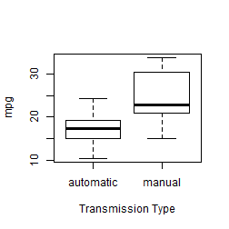
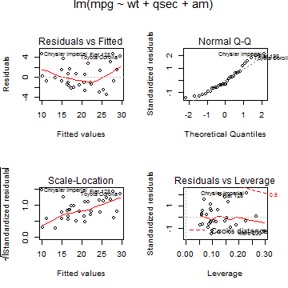

Effect of Transmission Type on Miles Per Gallon
===============================================

Executive Summary
-----------------
In this paper we examine the Motor Trends data on the effect of transmission type on
miles per gallon (mpg).  First we determine whether an automatic or manual transmission
is better for mpg.  For this we conducted a t-test for the difference of mean mpg between
cars with automatic or manual transmission.  At $\alpha=0.05$ we find there is a statistically
significant difference in mpg between automatic and manual transmissions.  Second we quantifying the effect of transmission type on mpg.  Using a linear regression model we see that a 
manual transmission can increse the expected mpg by 2.936 when all other factors are
held constant.

Data Analysis
-------------

Obtain the transmission type (automatic or manual) and miles per gallon rating for cars in the Motor Trend Car Road Test. First we assess whether a manual or automatic transmission is better for mpg.  According to Figure 1 in the Appendix, automatic transmissions provide lower mpg.

We verify this by conducting a t-test for the difference mean mpg by transmission
type.  At $\alpha=0.05$, we see the t statistic is -3.7671 with a p-value 
of 0.0014, which indicates there is a statistically significant difference
between the respective mean values for mpg.

Modeling
--------
We prepare the data for modeling.  For non-categorical attributes, the mean is 
subtracted.  This will allow for realistic interpretation of the intercept term.


To quantify the effect of transmission type on mpg, we create a linear regression model 
using all the relevant variables,i.e., **mpg ~ cyl + disp + hp + drat + wt + qsec + vs + am + gear + carb**.  For this model the F-statistic is 13.9325 with a p-value of 3.7932 &times; 10<sup>-7</sup>, which show the model is
significant at the $\alpha=0.05$.  While the model may be significant, the
p-value for the coefficients indicate we cannot reject the null hypothesis that they are zero.

```
##             Estimate Std. Error t value Pr(>|t|)
## (Intercept) 19.61730    7.10884  2.7596  0.01175
## cyl         -0.11144    1.04502 -0.1066  0.91609
## disp         0.01334    0.01786  0.7468  0.46349
## hp          -0.02148    0.02177 -0.9868  0.33496
## drat         0.78711    1.63537  0.4813  0.63528
## wt          -3.71530    1.89441 -1.9612  0.06325
## qsec         0.82104    0.73084  1.1234  0.27394
## vs1          0.31776    2.10451  0.1510  0.88142
## ammanual     2.52023    2.05665  1.2254  0.23399
## gear         0.65541    1.49326  0.4389  0.66521
## carb        -0.19942    0.82875 -0.2406  0.81218
```

To find an alternative model, we use the **step** function to explore other formulations of the regression model.  After running the procedure, the **step** function selected this formulation as the optimal representation **mpg ~ wt + qsec + am**. For this second model, the F-statistic is 52.7496 with a p-value is 1.2104 &times; 10<sup>-11</sup>  The selected model has these coefficients, which based on the respective p-values are 
statistically significant.

```
##             Estimate Std. Error t value  Pr(>|t|)
## (Intercept)   18.898     0.7194  26.271 2.856e-21
## wt            -3.917     0.7112  -5.507 6.953e-06
## qsec           1.226     0.2887   4.247 2.162e-04
## ammanual       2.936     1.4109   2.081 4.672e-02
```
The model's intercept shows the expected mpg is 18.898 for a car with
the average weight and average seconds for a quater mile.  The coefficient for wt indicates
the mpg will decrease by 3.917 for every thousand pound increase in
weight.  For every second a car goes slower in the quarter mile, the coefficient for
qsec shows the mpg will increase by 1.226.  Finally, by using
a manual transmission, the mpg increases 2.936 over that from an
automatic transmission.

Figure 2 in the Appendix shows the regression diagnostic plots for this second model.
The residual plot shows there may be non-linear effect that merit further analysis.

The confidence intervals for these model parameters are

```
##                2.5 % 97.5 %
## (Intercept) 17.42441 20.371
## wt          -5.37333 -2.460
## qsec         0.63457  1.817
## ammanual     0.04573  5.826
```

\pagebreak

Appendix
--------
Summary statistics

```
##       mpg            cyl            disp             hp       
##  Min.   :10.4   Min.   :4.00   Min.   : 71.1   Min.   : 52.0  
##  1st Qu.:15.4   1st Qu.:4.00   1st Qu.:120.8   1st Qu.: 96.5  
##  Median :19.2   Median :6.00   Median :196.3   Median :123.0  
##  Mean   :20.1   Mean   :6.19   Mean   :230.7   Mean   :146.7  
##  3rd Qu.:22.8   3rd Qu.:8.00   3rd Qu.:326.0   3rd Qu.:180.0  
##  Max.   :33.9   Max.   :8.00   Max.   :472.0   Max.   :335.0  
##       drat            wt            qsec            vs       
##  Min.   :2.76   Min.   :1.51   Min.   :14.5   Min.   :0.000  
##  1st Qu.:3.08   1st Qu.:2.58   1st Qu.:16.9   1st Qu.:0.000  
##  Median :3.69   Median :3.33   Median :17.7   Median :0.000  
##  Mean   :3.60   Mean   :3.22   Mean   :17.8   Mean   :0.438  
##  3rd Qu.:3.92   3rd Qu.:3.61   3rd Qu.:18.9   3rd Qu.:1.000  
##  Max.   :4.93   Max.   :5.42   Max.   :22.9   Max.   :1.000  
##        am             gear           carb     
##  Min.   :0.000   Min.   :3.00   Min.   :1.00  
##  1st Qu.:0.000   1st Qu.:3.00   1st Qu.:2.00  
##  Median :0.000   Median :4.00   Median :2.00  
##  Mean   :0.406   Mean   :3.69   Mean   :2.81  
##  3rd Qu.:1.000   3rd Qu.:4.00   3rd Qu.:4.00  
##  Max.   :1.000   Max.   :5.00   Max.   :8.00
```


**Figure 1**
 

**Figure 2**
 

